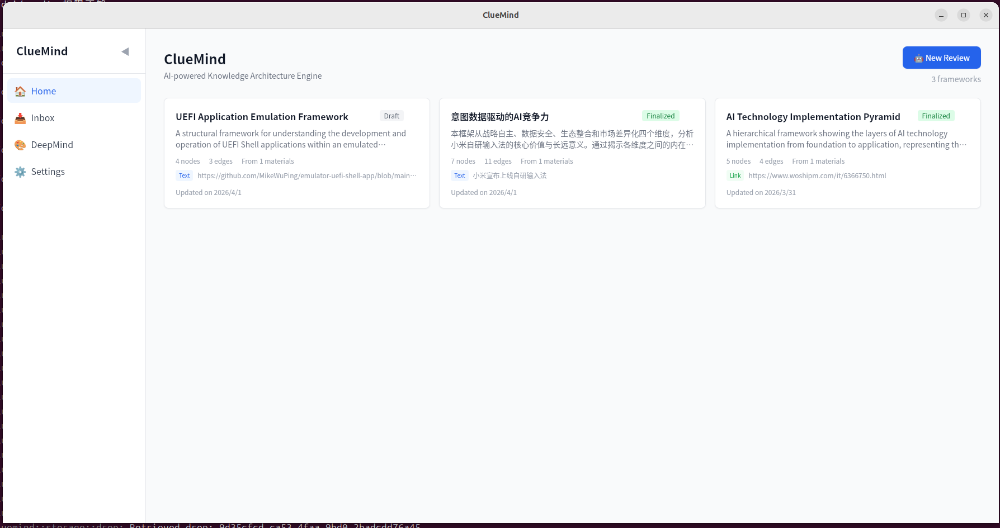
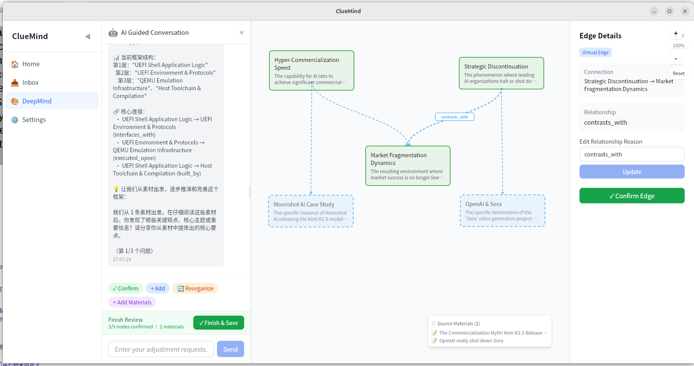
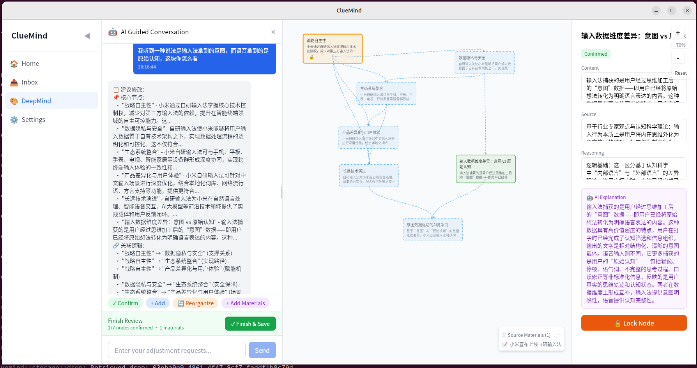

<div align="center">

# ClueMind

### AI-Driven Knowledge Architecture Elevation Engine

[](https://opensource.org/licenses/Apache-2.0)
[](https://github.com/junwide/ClueMind)
[](https://tauri.app)
[](https://github.com/junwide/ClueMind)

**Turn daily scattered information into structured knowledge architecture — AI is your thinking partner, co-building mental elevation.**

[English](#what-is-cluemind) | [中文文档](README_zh.md)

</div>

---

## What is ClueMind?


AI is evolving at breakneck speed, yet we still consume information linearly. It's time to let AI help us build the structure from information to insight — the knowledge and cognitive architectures that once required expensive courses to acquire.

You encounter countless articles, ideas, chat logs, and reading notes every day — seemingly disconnected and scattered? ClueMind is here to bridge the gap between **raw information** and **deep understanding**.


| Traditional Note-Taking | ClueMind |
|------------------------|----------|
| Manual linking, easily cluttered | AI co-builds structured architecture |
| Static node graphs, linear notes | Real-time conversation-driven canvas with virtual-real sync growth |
| Siloed, disconnected thoughts | AI discovers hidden relationships |
| Passive recording | Active elevation: AI thinks first + user refines together |





**Core Experience Loop**: One-Thought Drop → AI Partner Review → Knowledge Architecture Real-Time Growth → Mindscape View Overview → Continuous Elevation

---
## Features
### v0.1 (Current Release)

**Capture & Intake**
- Global shortcut (`Ctrl+Shift+D`) for instant text/URL capture — works system-wide
- Quick drop overlay for frictionless input
- Raw inbox for managing unprocessed materials

**AI Partner Review Agent**
- AI first thinks internally based on current Drops + historical notes, proactively proposing 1-3 reliable framework suggestions
- Conversational tone: "I've sketched an initial framework for you — how does this direction feel? Let's see if we can make it even better."
- Like brainstorming with a senior thinking partner, not an interrogation-style Q&A
- Free-form chat for iterative adjustments
- Multi-provider support: OpenAI (GPT-4o), Claude (Sonnet), GLM, MiniMax


**Interactive Knowledge Canvas**
- Visual graph editor for nodes and edges
- Three-state lifecycle: Virtual → Confirmed → Locked
- Inline editing for labels, content, sources, and reasoning
- Drag-and-drop node positioning
- Edge relationship editing

**Privacy & Experience**
- Local-first: all data stored on your device
- Bilingual UI: English & Chinese
- System keyring integration for secure API key storage
- Session persistence: resume where you left off

**Mindscape View (2D Basic)**
- Global mind star map — overview all knowledge architecture zones at a glance
- Overlapping knowledge shown with **dashed lines + translucent copies + glowing labels** for intuitive visualization
- Click any structure or overlap area to enter contextual AI deep conversation and continue elevating

## Roadmap

### Phase 1 — Core MVP (v0.1) ✅
- [x] Drop capture system
- [x] Knowledge framework data model
- [x] AI framework generation (multi-provider)
- [x] Interactive canvas with node/edge editing
- [x] Guided conversation flow
- [x] Local storage & persistence

### Phase 2 — Enhancement (v0.2+)
- [ ] Framework templates (pre-built structures for common domains)
- [ ] Rich media drops (images, files, voice memos)
- [ ] Framework version history & diff
- [ ] Export to Markdown, PNG, PDF
- [ ] Cross-framework search & linking
- [ ] Windows support

### Phase 3 — Ecosystem
- [ ] Mobile companion app (capture on the go)
- [ ] Browser extension (one-click web clipping)
- [ ] Plugin system for custom AI providers
- [ ] Collaborative frameworks (multi-user)
- [ ] Knowledge graph analytics & insights
- [ ] CLI tools for batch operations

## Tech Stack

| Layer | Technology | Purpose |
|-------|-----------|---------|
| Frontend | React 18 + TypeScript | UI framework |
| | TailwindCSS | Utility-first styling |
| | Zustand | State management |
| | Radix UI | Accessible components |
| Backend | Tauri 2.0 | Desktop app framework |
| | Rust | Core logic & data layer |
| | reqwest | HTTP client (AI API calls) |
| | keyring | Secure credential storage |
| AI | Multi-provider | OpenAI / Claude / GLM / MiniMax |
| Build | Vite 5 | Frontend bundler |
| | Vitest | Frontend testing |

## Getting Started

### Prerequisites

- **Node.js** 18+ and npm
- **Rust** 1.70+ ([install](https://rustup.rs))
- **Tauri 2.0 CLI**: `npm install -g @tauri-apps/cli`
- **System dependencies**: See [Tauri prerequisites](https://v2.tauri.app/start/prerequisites/)

### Install & Run

```bash
# Clone the repository
git clone https://github.com/junwide/ClueMind.git
cd ClueMind

# Install frontend dependencies
npm install

# Start development mode
npm run tauri dev
```

### First-Time Setup

1. Launch the app — you'll see the Home page
2. Go to **Settings** (gear icon in sidebar)
3. Configure at least one LLM provider (e.g., OpenAI API key)
4. Click **Test** to verify your connection

### Quick Start

1. **Capture**: Press `Ctrl+Shift+D` anywhere on your system to drop text or URLs
2. **Build**: Click **New Review** on the Home page, select your drops
3. **Refine**: AI generates a framework — confirm, edit, or reorganize via conversation
4. **Lock**: Lock important nodes to protect them from AI modifications

## Build for Production

```bash
npm run tauri build
# Output: src-tauri/target/release/bundle/
```

## Development

```bash
npm run dev           # Frontend only (Vite dev server)
npm run tauri dev     # Full Tauri dev mode
npm run test:run      # Run tests once
npm test              # Run tests in watch mode
cargo test            # Rust tests
cargo clippy          # Rust linter
cargo fmt             # Format Rust code
```

## Project Structure

```
src/                        # React frontend
├── components/
│   ├── AI/                # AI conversation & dialog
│   ├── Canvas/            # Knowledge graph canvas
│   ├── Drop/              # Quick capture components
│   ├── Layout/            # App layout & sidebar
│   └── Settings/          # Settings & configuration
├── pages/                 # Route pages (Home, Canvas, Inbox, Settings)
├── hooks/                 # Custom React hooks
├── stores/                # Zustand state stores
├── types/                 # TypeScript type definitions
├── i18n/                  # Internationalization (en, zh)
└── utils/                 # Utility functions

src-tauri/                 # Rust backend
├── src/
│   ├── commands/          # Tauri IPC command handlers
│   ├── models/            # Data models (Drop, Framework, Config)
│   ├── storage/           # JSON file storage layer
│   ├── config/            # Provider configuration + keyring
│   ├── framework/         # Framework utility functions
│   ├── sidecar/           # Python sidecar management
│   └── error/             # Error handling
└── tauri.conf.json        # Tauri app configuration
```

## Architecture

```
┌─────────────────────────────────────────────┐
│                 React Frontend               │
│  ┌──────────┐ ┌───────────┐ ┌────────────┐  │
│  │   Home   │ │  Canvas   │ │  Settings  │  │
│  └────┬─────┘ └─────┬─────┘ └─────┬──────┘  │
│       │             │              │          │
│  ┌────┴─────────────┴──────────────┴──────┐  │
│  │         Tauri IPC (invoke)              │  │
│  └─────────────────┬──────────────────────┘  │
├────────────────────┼─────────────────────────┤
│               Rust Backend                   │
│  ┌─────────────────┴──────────────────────┐  │
│  │            Command Handlers            │  │
│  └───┬─────────┬──────────┬───────────────┘  │
│  ┌───┴───┐ ┌───┴────┐ ┌───┴────────┐         │
│  │Storage│ │Config  │ │ Direct AI  │         │
│  │ (JSON)│ │+Keyring│ │  (reqwest) │         │
│  └───────┘ └────────┘ └────────────┘         │
└──────────────────────────────────────────────┘
         │                    │
    ~/.local/share/      LLM APIs
    cluemind/    (OpenAI/Claude/
    drops/             GLM/MiniMax)
    frameworks/
    conversations/
```

## Data Privacy

ClueMind is **local-first** by design:

- All knowledge frameworks, drops, and conversations are stored locally on your device
- API keys are secured in your system keyring (not in config files)
- AI API calls are made directly from your machine — no intermediary servers
- No telemetry, no analytics, no data collection

## Supported LLM Providers

| Provider | Default Model | API Format |
|----------|--------------|------------|
| OpenAI | gpt-4o | OpenAI |
| Claude | claude-3-5-sonnet | Anthropic |
| GLM (Zhipu) | glm-4.7 | OpenAI |
| MiniMax | minimax 2.7 | OpenAI |

## Contributing

Contributions are welcome! Whether it's bug reports, feature requests, or code contributions.

1. Fork the repository
2. Create your feature branch: `git checkout -b feature/my-feature`
3. Commit your changes: `git commit -m 'Add some feature'`
4. Push to the branch: `git push origin feature/my-feature`
5. Open a Pull Request

## License

This project is licensed under the [Apache License 2.0](LICENSE).

```
Copyright 2024-2026 junwide

Licensed under the Apache License, Version 2.0 (the "License");
you may not use this file except in compliance with the License.
You may obtain a copy of the License at

    http://www.apache.org/licenses/LICENSE-2.0

Unless required by applicable law or agreed to in writing, software
distributed under the License is distributed on an "AS IS" BASIS,
WITHOUT WARRANTIES OR CONDITIONS OF ANY KIND, either express or implied.
See the License for the specific language governing permissions and
limitations under the License.
```

## Author

**junwide** — [GitHub](https://github.com/junwide)

Project Link: [https://github.com/junwide/ClueMind](https://github.com/junwide/ClueMind)
